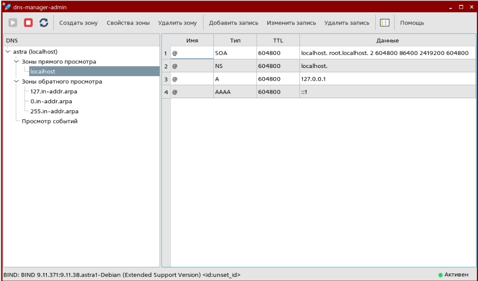

# dns-manager-bind


Графический менеджер DNS-зон для сервера **BIND9** в Linux. Позволяет управлять зонами и ресурсными записями через наглядный интерфейс — без ручного редактирования конфигурационных файлов и работы в командной строке.

> Выпускная квалификационная работа (ГУАП, 2026). Разработан под Astra Linux, где отсутствует стабильный штатный DNS-менеджер с открытым исходным кодом.



## Возможности

- Управление зонами прямого и обратного просмотра в виде иерархического дерева
- Просмотр и редактирование ресурсных записей (SOA, NS, A, AAAA и др.) через диалоги с валидацией
- Мастер создания зоны из четырёх шагов
- Рекурсивный разбор директив `include` в `named.conf` с защитой от циклов
- Автоматический откат `named.conf` при неудачной валидации — сервер не остаётся в нерабочем состоянии
- Асинхронное управление демоном (запуск / остановка / перезагрузка) без блокировки интерфейса
- Встроенный просмотр событий

## Архитектура

Приложение разделено на четыре слоя с однонаправленными зависимостями — каждый слой обращается только к нижестоящему:

```
ui/       интерфейс: главное окно, диалоги, мастер зон
dns/      оркестрация: единственная точка системных вызовов и работы с BIND9
parser/   чтение и запись named.conf без системных вызовов
model/    чистые структуры данных
```

Такое разделение делает слои `parser/` и `model/` независимыми от графической оболочки и от запущенного сервера, что позволяет полноценно покрывать их модульными тестами.

## Стек

- **Язык:** C++17
- **GUI:** Qt 5
- **Сборка:** CMake, пакетирование через CPack (deb)
- **Тесты:** Google Test
- **Взаимодействие с BIND9:** через штатные консольные утилиты (решение не зависит от версии сервера)

## Установка (deb-пакет)

```bash
sudo dpkg -i dns-manager-admin_*.deb
```

Зависимости (`bind9`, `libqt5widgets5`, `libqt5core5a`) объявлены в пакете и разрешаются автоматически — ручная настройка окружения не требуется.

## Сборка из исходников

```bash
cmake -B build -DCMAKE_BUILD_TYPE=Release
cmake --build build

# сборка deb-пакета
cd build && cpack -G DEB
```

## Тестирование

Модульными тестами покрыты слои `model/` и `parser/`: разбор `named.conf`, обработка `include` с защитой от циклов, формирование текста зоны. Тесты выполняются без BIND9 и без графической оболочки.

```bash
ctest --test-dir build
```

Ручное тестирование проводилось на стенде Astra Linux CE 2.12 с BIND9 9.18: пройдены все функциональные сценарии, включая откат конфигурации при ошибке валидации и устойчивость интерфейса при перезапуске демона.

## Направления развития

- Удалённое управление несколькими серверами
- Интеграция просмотра системного журнала BIND9

## Лицензия

GPL — см. файл [LICENSE](LICENSE).
